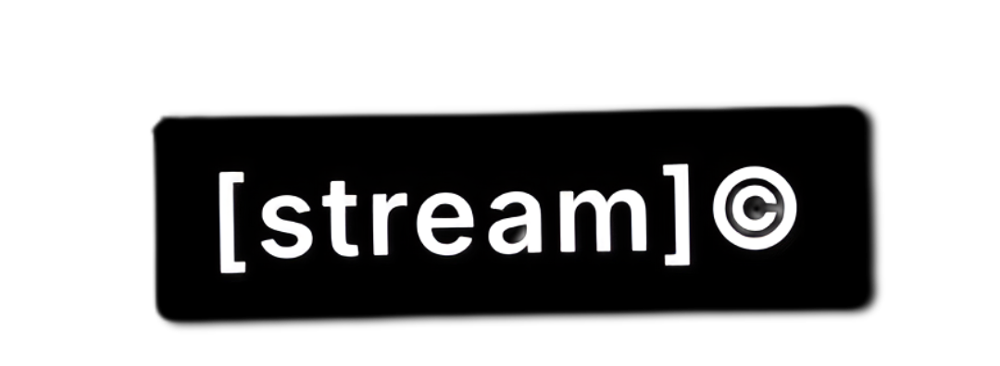

<div align="center">
  
  
  
  **A minimal note-taking app that embraces ephemerality**
  
  [Live Demo](https://stream-notes.com) · [Features](#features) · [Quick Start](#quick-start) · [Philosophy](#philosophy)
  
</div>

---

## What is stream?

[stream] is a minimal note notebook designed for the way you actually think. Active notes auto-expire, but you can keep what matters, organize with folders, and capture lightweight todos without disrupting your flow.

Unlike traditional note apps that accumulate digital clutter, stream helps you focus on what's important *now* while preserving the ideas worth keeping.

## Features

### **Flow-First Design**
- **Ephemeral capture** – Active notes self-delete after your chosen timer (1h to 7 days)
- **Instant input** – Start typing immediately, no friction
- **Auto-save** – Never lose a thought mid-stream

### **Smart Organization**
- **Saved collections** – Move important notes to permanent storage
- **Folders** – Optional organization that works across active and saved notes
- **Inline todos** – Mark any note as a todo, complete, or clear from the list
- **Custom timers** – Set different expiration times per note

### **AI-Powered**
- **Flow formatting** – AI cleans up your notes for better readability
- **Talk to [stream]** – Natural language assistant for themes, settings, notes, and jokes
- **Smart commands** – "save all my notes", "change theme to dark", "set timer to 6 hours"

### **Expressive Modes**
- **SAMO art mode** – Transform notes into Basquiat-inspired visual art
- **Multi-theme** – White, beige, dark, matrix, and edge themes
- **Typography controls** – Customize font size and style

### **Sync & Collaboration**
- **Cross-device sync** – Optional Supabase integration keeps devices aligned
- **Local-first** – Works completely offline, sync when you want
- **Privacy-focused** – Your notes stay on your device unless you enable sync

### **Keyboard-Friendly**
- Quick shortcuts for add, save, move, and format
- Seamless navigation without leaving the keyboard
- Focus mode for distraction-free writing

## Quick Start

### Prerequisites
- Node.js 16+ and npm

### Installation

```bash
# Clone the repository
git clone https://github.com/glebbogachev00/stream-notes.git
cd stream-notes

# Install dependencies
npm install

# Start the development server
npm start
```

The app will open at `http://localhost:3000`

### Optional: Enable AI Features

To unlock Flow Formatting and Talk to Stream:

1. Get a [Groq API key](https://console.groq.com)
2. Set up the backend:
   ```bash
   cd server
   npm install
   echo "GROQ_API_KEY=your_key_here" > .env
   npm run dev
   ```

### Optional: Enable Sync

Create a `.env` file in the root directory:

```env
# For Supabase sync (recommended)
REACT_APP_SUPABASE_URL=your_supabase_url
REACT_APP_SUPABASE_ANON_KEY=your_anon_key

# For custom sync endpoint
REACT_APP_SYNC_URL=http://localhost:3001
```

## Project Structure

```
stream/
├── src/                    # React frontend
│   ├── components/         # UI components
│   ├── contexts/          # React contexts (settings, auth, storage)
│   ├── hooks/             # Custom React hooks
│   ├── services/          # API and business logic
│   └── utils/             # Helper functions
├── server/                # Optional sync backend
│   ├── routes/            # API endpoints
│   └── db/               # Database schema and migrations
├── public/               # Static assets
└── scripts/              # Development helpers
```

## How [stream] is Different

| Traditional Notes | [stream] |
|-------------------|----------|
| **Accumulate forever** | **Auto-expire by default** |
| **Manual organization** | **Effortless flow** |
| **Save everything** | **Keep only what matters** |
| **Complex interfaces** | **Minimal friction** |
| **Digital hoarding** | **Focused thinking** |

### Why Ephemeral Notes?

Most thoughts are transitional. They serve their purpose and naturally fade from relevance. By automatically clearing old notes, [stream] keeps you focused on current ideas while still preserving what you choose to save.

## Development

### Available Scripts

```bash
npm start          # Development server
npm test           # Run Jest tests
npm run build      # Production build
npm run lint       # Code linting
npm run eject      # Eject from Create React App
```

### Backend Development

```bash
cd server
npm run dev        # Start development server
npm run build      # Build for production
npm start          # Start production server
```

### Contributing

1. **Code quality**: Run `npm run lint` before committing
2. **Testing**: Add tests for new features and bug fixes
3. **Style guide**: Keep UI copy in lowercase (house style)
4. **Documentation**: Only add comments where intent is non-obvious

Issues and pull requests are welcome! Please reference any related tickets in your PR description.

## Screenshots

*Coming soon - showcasing the beautiful, minimal interface*

## Use Cases

- **Daily journaling** with natural expiration
- **Meeting notes** that don't clutter your workspace
- **Quick todos** that clear themselves
- **Creative writing** with flow formatting
- **Idea capture** without long-term storage anxiety
- **Focus sessions** with distraction-free interface

## Roadmap

- [ ] Mobile app (React Native)
- [ ] Collaborative notes
- [ ] Advanced AI formatting options
- [ ] Plugin system
- [ ] Export integrations (Notion, Obsidian)
- [ ] Voice notes with transcription

## Community

- **Issues**: Report bugs and request features
- **Discussions**: Share your workflows and ideas
- **Contributing**: Help make stream better

## License

Licensed under the [Apache License, Version 2.0](LICENSE). 

You're free to:
- Use stream commercially
- Modify and distribute
- Build products on top of stream

Just keep license headers intact and share improvements when you can.

## Acknowledgments

Built with love by [@glebbogachev00](https://github.com/glebbogachev00)

Inspired by the philosophy that most information is ephemeral, and tools should respect the natural flow of human thought.

---

<div align="center">
  
  **Start your stream of consciousness**
  
  [Try it now](https://stream-notes.vercel.app) · [Star this repo](https://github.com/glebbogachev00/stream-notes)
  
</div>